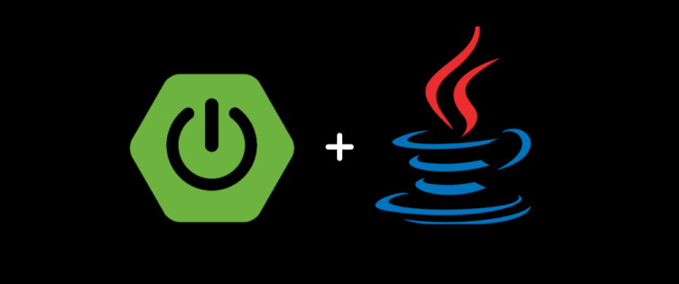

# Roadmap para Desarrollador Back-end con Java

     

Este es un roadmap que proporciona una guía de los temas y habilidades importantes para convertirse en un desarrollador back-end utilizando el lenguaje de programación Java. El objetivo de este roadmap es proporcionar una estructura para aprender y desarrollar las habilidades necesarias en el campo del desarrollo back-end.

## Fundamentos de programación
- Variables, tipos de datos, operadores, bucles y condicionales.
- Funciones y modularidad en la programación.

## Java Fundamentals
- Sintaxis básica de Java.
- Clases y objetos.
- Excepciones y manejo de errores.
- Herencia y polimorfismo.
- Interfaces y paquetes.
- Programación multi-hilo.

## Estructuras de datos y algoritmos
- Listas, pilas, colas y árboles.
- Búsqueda y ordenación de datos.
- Recursividad.

## Bases de datos
- Aprender SQL.
- Interactuar con bases de datos relacionales como MySQL o PostgreSQL.
- Familiarizarse con bases de datos NoSQL como MongoDB.

## Java Frameworks y Bibliotecas
- Spring Framework (Spring MVC, Spring Boot, Spring Security, etc.).
- Hibernate para mapeo objeto-relacional.
- JUnit para pruebas unitarias.
- Log4j para el registro de eventos.
- Apache HttpClient para realizar solicitudes HTTP.

## API RESTful
- Construir y consumir APIs RESTful utilizando Java y Spring Boot.

## Arquitectura de microservicios
- Implementar microservicios utilizando Spring Boot y Spring Cloud.
- Escalabilidad, tolerancia a fallos y descubrimiento de servicios.

## Contenedores y orquestación
- Uso de Docker para contenerizar aplicaciones Java.
- Orquestación de contenedores con Kubernetes.

## Integración y entrega continua (CI/CD)
- Herramientas de CI/CD como Jenkins, Travis CI, etc.
- Automatización de pruebas y despliegue.

## Pruebas
- Pruebas unitarias, de integración y de sistema.
- Bibliotecas como JUnit y Mockito.

## Patrones de diseño
- Patrones de diseño comunes en Java.
- Patrón MVC (Modelo-Vista-Controlador) en aplicaciones web.

## Seguridad
- Autenticación y autorización.
- Gestión de tokens y sesiones.
- Protección contra ataques comunes (injection, XSS, CSRF, etc.).
- Uso de frameworks de seguridad como Spring Security.

## Cloud y Proveedores de servicios en la nube
- Servicios en la nube como AWS, Google Cloud, Azure, etc.
- Despliegue de aplicaciones en la nube.

## DevOps
- Principios de DevOps y su aplicación en el desarrollo de software.
- Automatización de despliegues y configuraciones.

## Técnicas de Caching
- Uso de herramientas como Redis, Memcached y EHCache.
- Mejora del rendimiento de aplicaciones mediante el caching.

## Procesamiento de grandes volúmenes de datos
- Apache Hadoop para el procesamiento distribuido de datos.
- Apache Spark y Apache Flink para el procesamiento en tiempo real.

## Seguridad en la nube
- Mejores prácticas de seguridad para aplicaciones y servicios en la nube.
- Autenticación, etc

Emerson González

